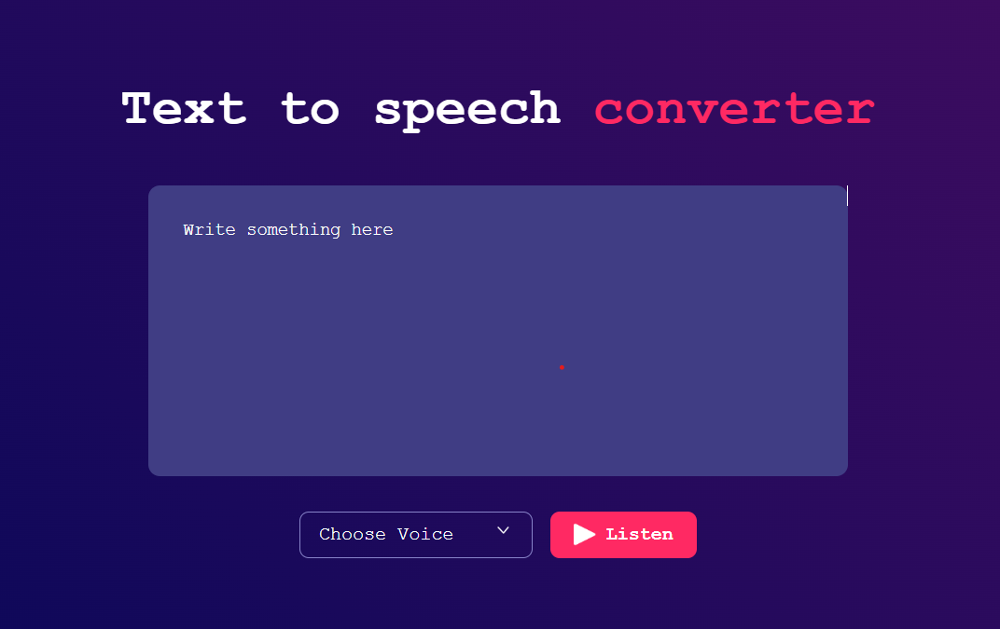

# 🗣️ Text to Voice Converter

A simple and responsive Text to Voice Converter built using **HTML**, **CSS**, and **JavaScript**. This project uses the **Web Speech API** to convert user-inputted text into speech. Created as part of my **#30Days30Projects** challenge.

---

## 🚀 Features

- Convert any typed text into speech
- Easy-to-use interface
- Multiple voice/language options (based on browser support)
- Fully responsive and styled with a modern UI

---

## 🛠️ Tech Stack

- HTML
- CSS
- JavaScript (Web Speech API)

---

## 📸 Preview



---

## 📦 How to Use

1. Clone the repository:
   ```bash
   git clone https://github.com/your-username/text-to-voice-converter.git
   ```
